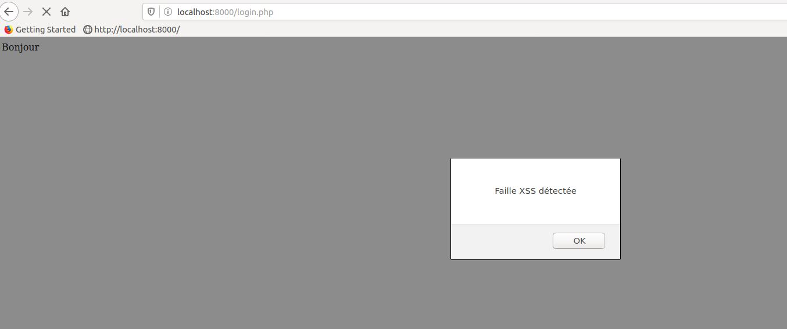
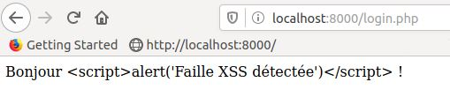

Projet de sécurité web IMT Atlantique : Faille XSS (exemple 3)

Auteurs : Yoann Hémon, Georges Beunardeau, Nicolas Lefort

Exercice 1 : voir reponsecodecludeo.md

Exercice 2:
Se placer dans xss-vulnerable. Exécuter la commande php -S localhost:8000 (si nécessaire, faire sudo apt install php7.2-cli). Dans un navigateur, aller sur localhost:8000 et envoyer une entrée correcte dans la barre de texte. Puis essayer avec du code par exemple : . Dans ce cas, une fenêtre d'alerte apparait ; la faille XSS a été exploitée.

Ensuite se placer dans xss-resistant et faire les mêmes manipulations. On constate que le code n'a pas été exécuté mais apparait tel quel sur la page web. L'entrée a été "sanitisée" grâce à la fonction htmlspecialchars qui convertit les caractères spéciaux en entités HTML. En l'occurence, les caractères & ' " > et < ont été remplacés. Ainsi, il est impossible "d'échapper" la chaîne de caractères entrée pour rajouter du code dans le code source de la page.

